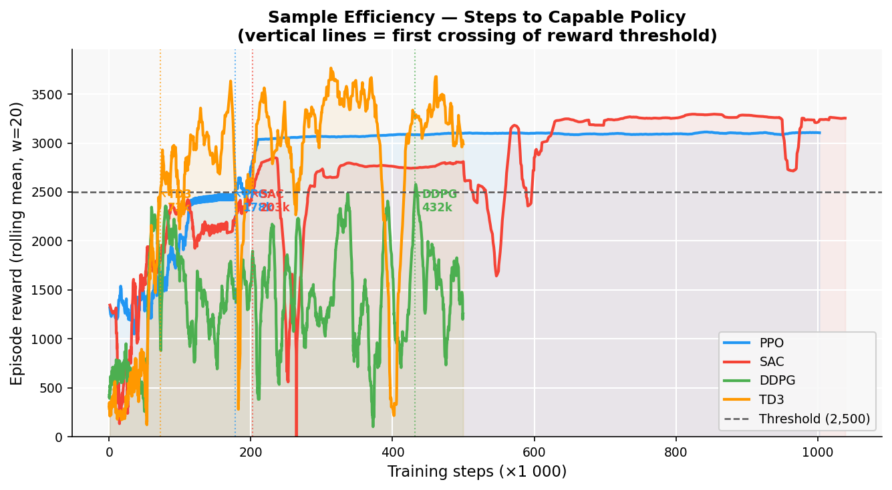
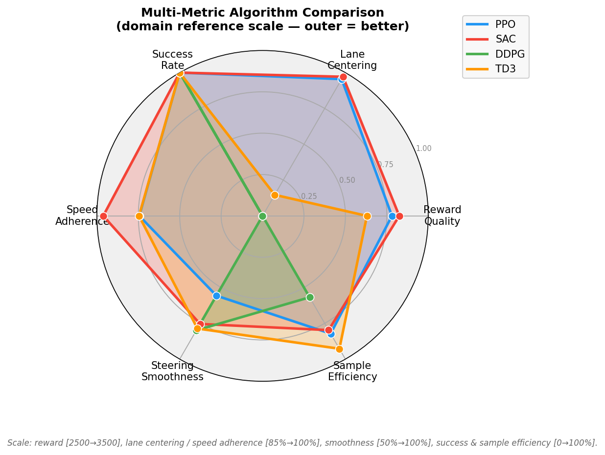
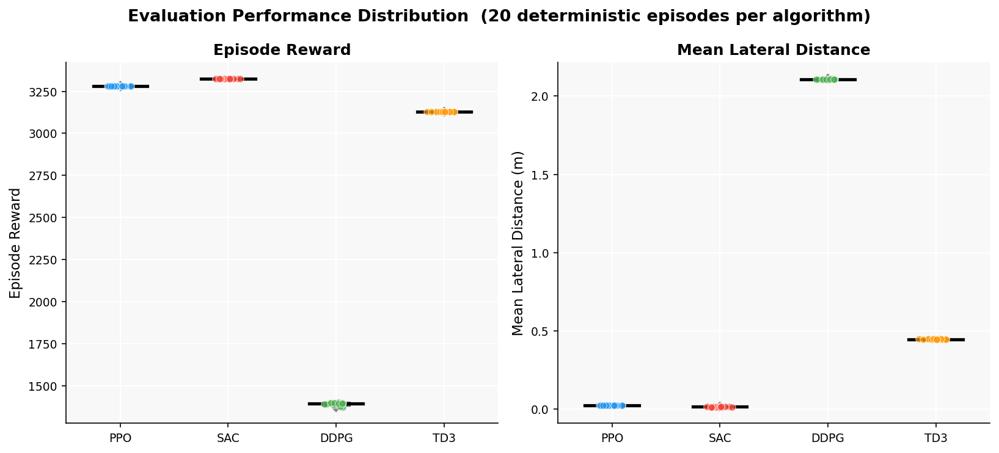
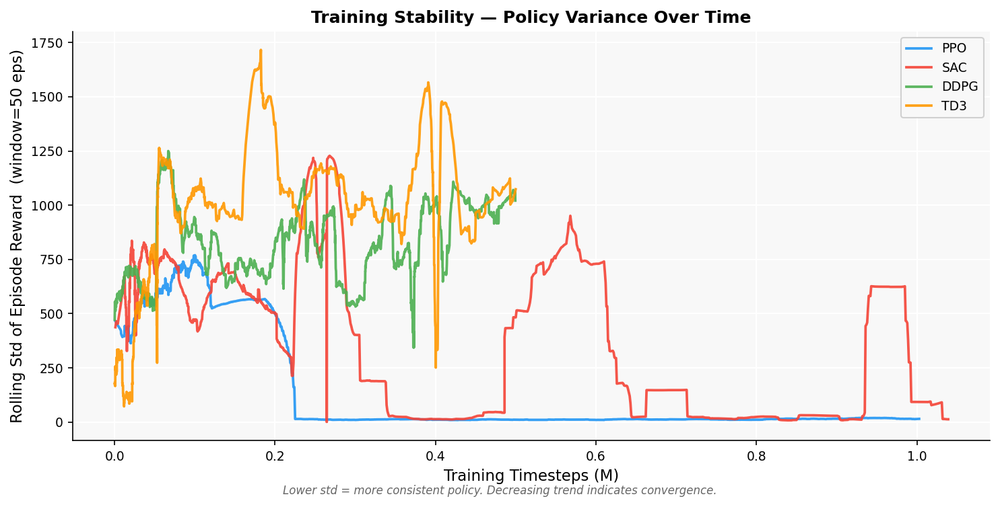
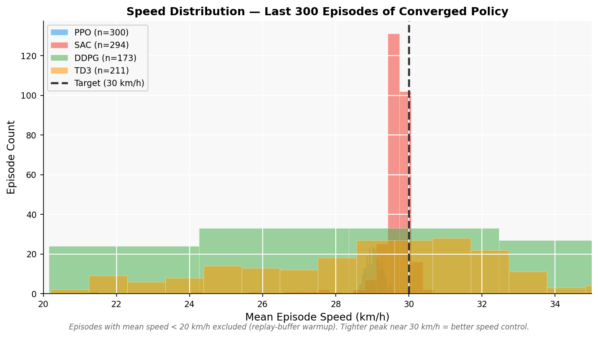

# CARLA Reinforcement Learning — Lane Keeping Agent

Thesis project comparing reinforcement learning algorithms for autonomous vehicle lane keeping in CARLA 0.9.15. The car observes four numbers — lateral displacement from lane center, heading error, speed, and its own last steering command — and learns to output throttle/brake and steering to stay centered at 30 km/h.

**Algorithms:** PPO · SAC · DDPG · TD3  
**Framework:** Stable-Baselines3 2.0.0 · Gymnasium 0.28.1 · Python 3.7.16  
**Simulator:** CARLA 0.9.15 · Town04 highway loop · Synchronous mode (20 Hz)

---

## Results

Each algorithm runs 20 evaluation episodes with a fixed spawn point and no action noise. An episode ends either at 1000 steps — 50 simulated seconds at ~30 km/h — or earlier if the car crashes, leaves the lane, or points the wrong way. Reaching 1000 steps is a success.

| Algorithm | Training Steps | Episode Reward (mean ± std, 20 episodes) | Mean Lateral Distance | Success Rate |
|-----------|---------------|------------------------------------------|-----------------------|--------------|
| **PPO** | ~1M | 3280.89 ± 0.09 | 0.024 m | 100% |
| **SAC** | ~1M | 3325.06 ± 0.09 | **0.015 m** | 100% |
| DDPG | — | — | — | not yet trained |
| TD3 | — | — | — | not yet trained |

**Episode reward** is the sum of per-step rewards over 1000 steps (see Reward Function). A perfect run — centered at exactly 30 km/h, zero heading error, perfectly smooth steering — scores roughly 3400. The ±0.09 standard deviation across 20 episodes is near-zero because deterministic evaluation with a fixed spawn produces nearly identical trajectories every run; the only variation comes from floating-point timing in CARLA's physics step. **Mean lateral distance** is averaged across every step of every episode: PPO stays within 2.4 cm of center on average, SAC within 1.5 cm.

---

## Figures

### Training Curves

The y-axis is total episode reward — the sum of 1000 per-step shaped rewards. The x-axis counts how many environment steps the policy has processed. Faded points are individual training episodes; the solid line is a 20-episode rolling mean that removes per-episode noise to show the trend. PPO climbs steadily from ~1000 to ~3100 over 1M steps — on-policy updates process each batch of experience once, so progress is incremental. SAC starts low during the first ~10k steps while the replay buffer fills with random-action data, then improves quickly; the higher early variance reflects the buffer drawing from a mix of early and recent experience.


---

### Algorithm Performance Comparison

Bar heights are means over 20 deterministic evaluation episodes; error bars show ±1 standard deviation across those 20 episodes. For episode reward, higher means more total accumulated reward — the car stayed centered, drove at target speed, and maintained good heading for longer. For lateral distance, lower means the car stayed closer to lane center. The near-zero error bars confirm both policies are stable — not just high on average, but consistently high run to run.


---

### Lane Centering Progress

The y-axis is mean lateral distance per training episode — average displacement from lane center during that episode. This is the training policy, which is stochastic, so the values are noisier than evaluation. The 0.5 m dashed line marks the point where the car's drift becomes obvious to an observer; the 0.1 m dotted line marks tight centering where a person in the car would barely notice any offset. Both algorithms reach sub-0.5 m early in training. SAC reaches and holds the 0.1 m level more consistently in the later phase, consistent with its better evaluation result (0.015 m vs 0.024 m).


---

### Episode Termination Breakdown

Each evaluation episode ends for one of four reasons: lane exit, collision, wrong heading (>90° from road direction), or reaching the 1000-step limit. Reaching the limit is a success — the car drove 50 seconds without any failure. Both PPO and SAC terminate 100% of episodes at the step limit during deterministic evaluation. There are no failures of any kind, meaning both policies are robust across all 20 trials, not just on a lucky run.


---

### Sample Efficiency

All training curves on a single time axis. The dashed line at reward = 2500 marks a policy that keeps the car in the lane reliably — below this threshold, the car still fails too often to be useful. Vertical markers show when each algorithm first crossed this threshold. An earlier crossing means fewer environment interactions were needed to reach useful behavior. This matters because each CARLA step takes real wall-clock time; sample efficiency directly determines how long training takes.



---

### Multi-Metric Radar Chart

Six axes represent six dimensions of performance. Each axis is normalized to a realistic range for this specific task — not to the theoretical maximum — so an algorithm that performs well appears as a large polygon, and differences between two good algorithms remain visible. The axes:

- **Reward quality** — episode reward mapped to [2500, 3500]. Below 2500 the policy is unreliable; 3500 is near-perfect.
- **Lane centering** — inverted lateral distance mapped to [0.85 m, 1.0 m] offset. The outer edge corresponds to 15 cm average displacement; the center of the axis is perfect centering.
- **Speed adherence** — how much of the episode the car spent near the 30 km/h target.
- **Steering smoothness** — how little the steering command changed between consecutive steps.
- **Success rate** — fraction of episodes completing without any failure.
- **Sample efficiency** — how quickly the policy crossed the 2500-reward threshold, mapped to [0, 1M] steps.



---

### Evaluation Score Distribution

Box plots of episode reward and mean lateral distance across the 20 evaluation episodes. The box spans the middle 50% of episodes (interquartile range); the line inside is the median; individual episode dots are overlaid with a small horizontal jitter to avoid overlap. The spread is extremely narrow (reward std ≈ 0.09) because a deterministic policy at a fixed spawn point traces nearly the same path every run. The vertical gap between the PPO and SAC boxes shows the algorithms are consistently separated — SAC is not just higher on average, it is higher on every single episode.



---

### Training Stability

The y-axis is the rolling standard deviation of episode reward over a 50-episode window — not the mean reward, but how much it varied within each window. High values mean the policy's performance was jumping around; low values mean it had settled. PPO drops to near-zero variance by ~200k steps and stays there: once it found a working policy, performance remained stable. SAC shows periodic spikes. Each spike corresponds to a training session restart: the replay buffer starts empty, the policy draws from low-quality early experience, performance dips, and variance rises until the buffer fills again. After each restart the spike subsides as the buffer warms up.



---

### Speed Distribution

Histogram of mean episode speed from the last 300 training episodes of each algorithm's final training run, covering the converged phase. Episodes with mean speed below 20 km/h are excluded — they belong to replay buffer warmup when SAC had not yet learned to drive. The dashed line at 30 km/h is the reward function's speed target. SAC clusters tightly around 30 km/h; PPO peaks around 28.5 km/h with a wider spread. The wider PPO distribution reflects its stochastic policy sampling different throttle values at each step, while SAC's entropy tuning converges to a narrower range of behaviors.



---

## System Architecture

### Observation Space

The agent receives four numbers per step. All are normalized before reaching the network so the network sees values in a consistent range regardless of physical units.

| Index | What it measures | Physical units | Normalized range | Why it is included |
|-------|-----------------|----------------|-----------------|-------------------|
| 0 | Lateral distance from lane center | −3.5 … +3.5 m | −1 … +1 | Primary task signal — what the car must minimize |
| 1 | Heading error (car vs road direction) | −π … +π rad | −1 … +1 | Tells the car how much to steer to realign |
| 2 | Speed | 0 … 80 km/h | 0 … +1 | Needed to hit the 30 km/h target |
| 3 | Previous steering command | −1 … +1 | −1 … +1 | Lets the network account for its own momentum |

Index 3 (previous steering) matters because the car's steering response has inertia. Seeing its own last command lets the network learn that large step-to-step changes cause oscillation and steer more smoothly.

### Action Space

The network outputs two numbers per step:

| Index | What it controls | Range | How it maps to CARLA |
|-------|-----------------|-------|----------------------|
| 0 | Longitudinal control | −1 … +1 | Positive → throttle, negative → brake |
| 1 | Steering | −1 … +1 | Sent directly to CARLA's steer input |

Actions are smoothed before reaching CARLA: `smoothed = 0.6 × new + 0.4 × previous`. Without this, a stochastic policy's sample-to-sample variation produces steering changes faster than the car can physically follow, causing the trajectory to oscillate.

### Reward Function

At each of the 1000 steps in an episode, the agent receives a scalar reward composed of four terms:

```
r = 1.0 × (1 − |lateral| / 3.5)        # 0 at lane edge, 1 when centered
  + 1.5 × exp(−((speed − 30)² / 200))   # Gaussian peak at 30 km/h, σ = 10 km/h
  + 0.5 × (1 − |heading| / π)           # 0 pointing sideways, 1 pointing along road
  + 0.5 × smoothness                     # 0 for large steering change, 1 for no change
  − 0.1                                  # constant per-step cost
  − 10.0  (only on collision or off-road) # terminal penalty, applied once
```

The speed term uses a Gaussian so the car gets partial credit for being near 30 km/h. At 25 km/h the car receives 78% of the peak speed reward; at 0 km/h it receives nearly nothing. Without this, a stationary car can score reasonable rewards from centering and smoothness alone — the stand-still local optimum. The per-step cost (−0.1) discourages unnecessary stopping and rewards efficient motion.

### Termination Conditions

| Trigger | Gymnasium signal | Consequence for learning |
|---------|-----------------|--------------------------|
| 1000 steps elapsed | `truncated` | Value function bootstraps from the estimated value at the final state |
| `|lateral| ≥ 3.5 m` | `terminated` | Terminal penalty applied; value bootstrap from zero |
| Collision sensor fires | `terminated` | Terminal penalty applied; value bootstrap from zero |
| `|heading| ≥ 90°` | `terminated` | Terminal penalty applied; value bootstrap from zero |

The `terminated`/`truncated` distinction matters for learning. A truncated episode hit a time limit — the car was doing fine and ran out of allowed steps. Treating it as a failure would make the policy avoid long successful runs. With the correct signal, the value function can estimate what reward the car would have continued to collect past the cutoff.

---

## Project Structure

```
carla_rl_project/
├── carla_env/              # Gym environment
│   ├── env.py              # CarlaLaneKeepingEnv
│   ├── observation.py      # 4D state vector
│   ├── action.py           # action smoother + CARLA control mapping
│   ├── reward.py           # reward function + termination
│   └── sensors.py          # collision sensor
├── agent/
│   ├── algorithms.py       # PPO / SAC / DDPG / TD3 registry
│   ├── train.py            # multi-algorithm training entry point
│   ├── evaluate.py         # deterministic evaluation script
│   └── callbacks.py        # episode logger + checkpoint callbacks
├── scripts/
│   ├── generate_metrics.py # print comparison table from CSV data
│   └── plot_metrics.py     # generate all thesis figures
├── configs/
│   └── config.yaml         # all hyperparameters — single source of truth
├── docs/
│   ├── figures/            # thesis figures (committed, visible on GitHub)
│   └── progress_report.md  # full progress report for thesis supervisor
└── results/                # generated at runtime — not committed
    ├── logs/{algo}/        # episode CSVs + TensorBoard logs
    └── checkpoints/{algo}/ # model weights
```

---

## Setup

### Requirements

- Ubuntu 22.04
- CARLA 0.9.15
- Conda (Miniconda or Anaconda)
- GPU with ≥ 6 GB VRAM

### Environment

```bash
conda create -n carla915 python=3.7.16
conda activate carla915
pip install -r requirements.txt
```

The CARLA Python egg is added to the `carla915` conda environment's `sitecustomize.py` — no manual PYTHONPATH needed after setup.

### Launch CARLA

```bash
cd /path/to/CARLA_0.9.15
./CarlaUE4.sh -quality-level=Low -nosound
```

---

## Usage

```bash
conda activate carla915
cd carla_rl_project

# Train an algorithm (CARLA must be running)
python agent/train.py --algo ppo
python agent/train.py --algo sac
python agent/train.py --algo ddpg
python agent/train.py --algo td3

# Resume from checkpoint
python agent/train.py --algo ppo --resume results/checkpoints/ppo/.../final_model.zip

# Evaluate a trained model (CARLA must be running)
python agent/evaluate.py --algo ppo \
    --checkpoint results/checkpoints/ppo/.../best_model/best_model.zip \
    --episodes 20

# Generate metrics table (no CARLA needed)
python scripts/generate_metrics.py

# Generate all figures (no CARLA needed)
python scripts/plot_metrics.py

# Monitor training
tensorboard --logdir results/logs
```

---

## Exploration vs Exploitation

The four algorithms differ fundamentally in how they balance exploring new actions against repeating actions that already work.

| Algorithm | Type | Policy | How it explores | Entropy control |
|-----------|------|--------|----------------|----------------|
| **PPO** | On-policy | Stochastic | Entropy bonus (`ent_coef=0.05`) penalizes policies that concentrate on one action | Fixed — set before training, does not change |
| **SAC** | Off-policy | Stochastic | Same entropy mechanism, but the target entropy level is learned automatically | **Automatic** — adjusts throughout training |
| **DDPG** | Off-policy | Deterministic | Gaussian noise (σ=0.1) added to the output action at execution time | None — noise schedule is fixed |
| **TD3** | Off-policy | Deterministic | Gaussian noise plus target policy smoothing and clipped double Q-functions | None — noise schedule is fixed |

In practice:

- PPO must have its entropy coefficient set correctly before training. `ent_coef=0.01` caused the agent to stop moving — a stationary car earns ~1880 reward per episode from centering and smoothness, and at low entropy the policy locked into that local optimum. `ent_coef=0.05` provides enough exploration pressure to escape it.
- SAC learns the right exploration level automatically and avoids the stand-still trap without manual tuning.
- DDPG and TD3 add noise to the output at execution time, keeping the policy deterministic at its core. The exploration schedule must be decided in advance rather than adapted during training.
- SAC, DDPG, and TD3 store all past experience in a replay buffer and sample from it repeatedly. PPO discards each batch after one update pass. This is why off-policy methods typically reach useful behavior with fewer environment interactions.

---

## Key Findings

1. **A 4D observation is sufficient** for lane keeping on a straight highway. The car does not need cameras or lidar — it only needs to know where it is laterally, which way it is pointing, how fast it is going, and what steering it applied last step.

2. **SAC centers more tightly** (0.015 m vs 0.024 m) because automatic entropy tuning finds the right exploration level without manual intervention. It neither overexplores (erratic steering) nor underexplores (stand-still).

3. **PPO is sensitive to entropy tuning**. At `ent_coef=0.01` the policy collapsed to standing still within the first ~100k steps. The stand-still local optimum yields ~1880 reward per episode from centering and smoothness alone. `ent_coef=0.05` pushes the policy past it.

4. **PPO's best checkpoint appeared at ~681k steps**. Continuing to 1M steps slightly degraded performance — the policy had already converged. Evaluation uses the 681k checkpoint, not the final weights.

5. **Action smoothing (α=0.6) is required for PPO**. A stochastic policy samples a new throttle and steering at every step. Without smoothing, the step-to-step steering variance causes oscillation the car cannot physically follow.

---

## References

- [CARLA Simulator](https://carla.org)
- [Stable-Baselines3](https://stable-baselines3.readthedocs.io)
- [Gymnasium](https://gymnasium.farama.org)
- [PPO — Schulman et al. 2017](https://arxiv.org/abs/1707.06347)
- [SAC — Haarnoja et al. 2018](https://arxiv.org/abs/1801.01290)
- [TD3 — Fujimoto et al. 2018](https://arxiv.org/abs/1802.09477)
- [DDPG — Lillicrap et al. 2015](https://arxiv.org/abs/1509.02971)
