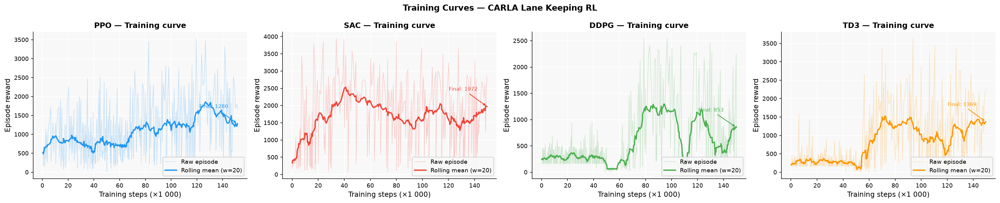
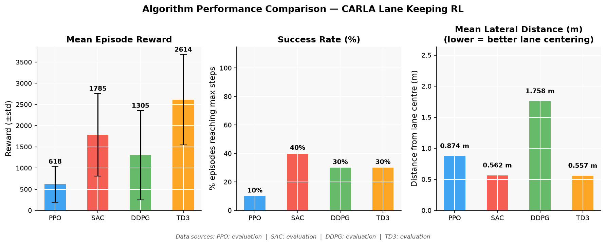
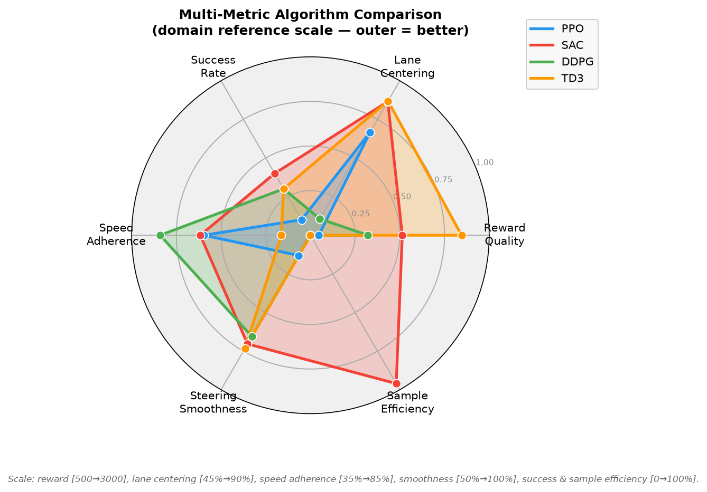
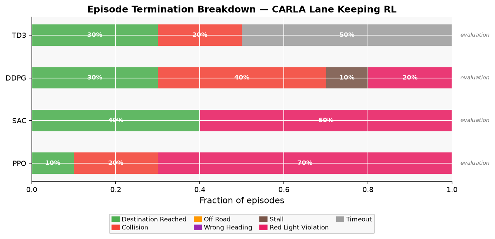
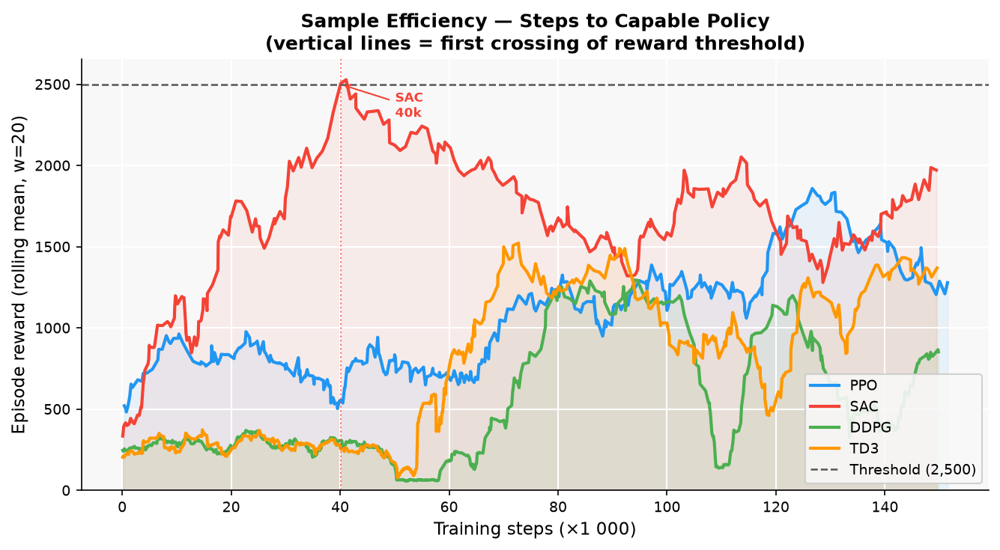
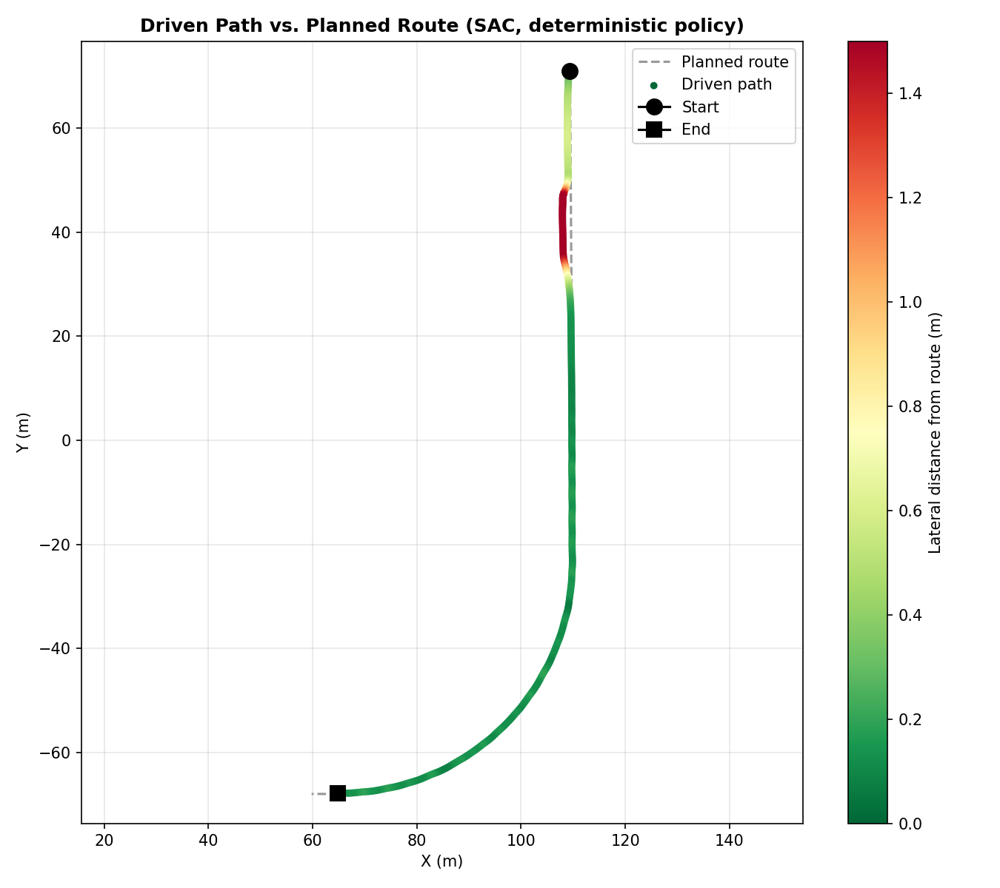
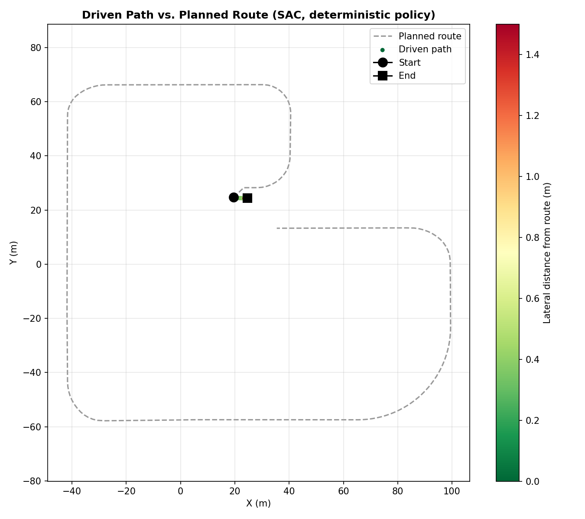
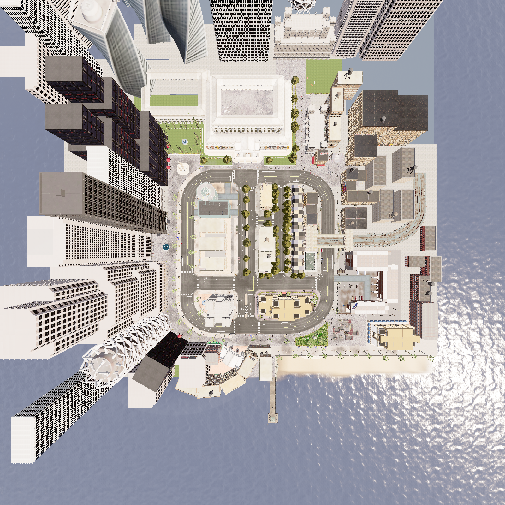
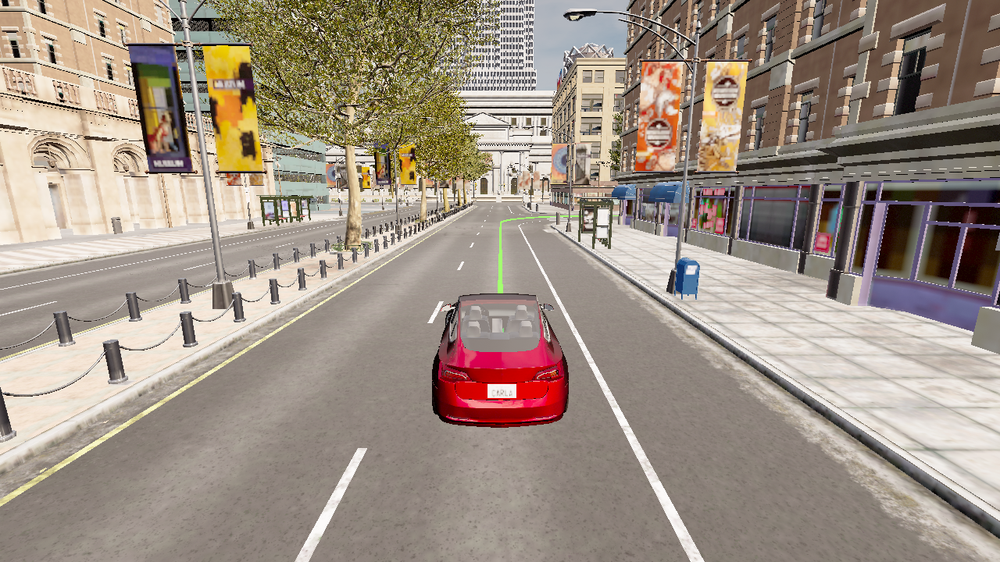
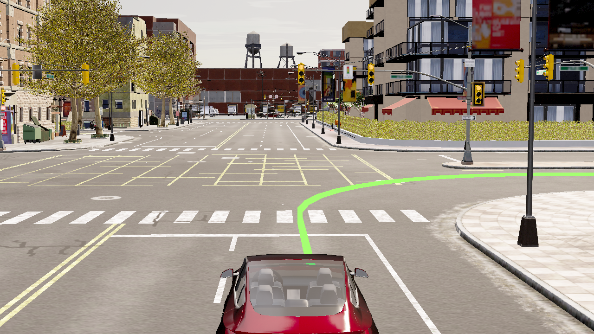

# Reinforcement Learning for Autonomous Driving in CARLA

**Lane keeping, route following, and traffic-light compliance at signalized intersections. A comparative study of PPO, SAC, DDPG, and TD3.**

This is the practical implementation behind my diploma thesis on reinforcement learning for autonomous vehicle control. A simulated car learns to follow an arbitrary planned route through an urban road network, stay in its lane, and stop for red lights, using nothing but a reward signal and a low-dimensional state vector, with no hand-coded driving rules. Four RL algorithms are trained under the same conditions and compared head-to-head.

---

## 1. Problem and scope

Pure lane keeping, staying centered on a straight or gently curving road, is a well-covered RL benchmark at this point. What made this project harder was pushing it into two areas that most lane-keeping papers skip: driving through actual signalized intersections along a planned route, and treating traffic-light compliance as part of the task itself rather than something bolted on afterward.

Both of these run into the same underlying problem. "Stay near the road" stops being well-defined at a junction, because several lanes belonging to crossing or turning paths are all physically close to the car at once. The only thing that tells you which one actually matters is the route planned for that specific episode.

The agent drives in [CARLA](https://carla.org) 0.9.15's `Town10HD_Opt` map, a mixed urban area with real intersections, traffic lights, and multi-lane roads.

## 2. System architecture

### 2.1 Observation and action spaces

| Observation (5D, normalized to ≈[-1, 1]) | Action (2D, continuous) |
|---|---|
| Lateral distance from the planned route's centerline | Acceleration (throttle/brake) |
| Heading error relative to the route direction | Steering |
| Vehicle speed | |
| Previous steering command | |
| Traffic-light state (must-stop / clear) | |

Lateral distance and heading error are measured against the closest point **on the planned route**, not against CARLA's own "nearest lane, whichever it is" lookup. That distinction matters a lot inside junctions, where the nearest lane and the correct lane are often not the same thing. Actions get smoothed exponentially (α = 0.6) before being applied, mainly so a stochastic policy's step-to-step sampling noise doesn't show up as physically implausible steering jitter.

### 2.2 Route planning and traffic-light compliance

Each episode plans a route between a randomly chosen start and destination using CARLA's road-topology graph (`GlobalRoutePlanner`, A* under the hood). Tracking progress along that route every step turned out to be less trivial than it sounds: a naive "closest waypoint" search will happily snap onto a spatially closer point on a completely different street if the grid is dense enough. The tracker used here walks forward from the last known position instead, tolerates a bit of backward drift (rolling back slightly on an incline, for instance), and never jumps ahead to an out-of-sequence point no matter how close it is.

Traffic-light state comes straight from CARLA's ground truth. A violation is only flagged the moment the car exits a light's trigger zone while still moving above a small speed threshold, not for the whole time a light is red, which would end up punishing normal braking distance and legitimate waiting along with actual violations.

### 2.3 Reward function

At every step:

```
r = w_center   · (1 − |lateral| / max_lateral)
  + w_speed    · exp(−(speed − target)² / 2σ²)
  + w_heading  · (1 − |heading_error| / π)
  + w_smooth   · max(0, 1 − Σ|Δaction| / 4)
  + w_progress · min(speed, target) / target
  + r_terminal + r_step
```

Five shaped terms (centering, a Gaussian speed target peaking at 30 km/h, heading alignment, action smoothness, and forward progress) plus a small per-step cost and a terminal penalty that only applies on failure, never on a timeout or a successful route completion. The progress term was added late, after noticing that the Gaussian speed reward alone still gives a small non-zero reward at zero speed. DDPG and TD3 both found and exploited that: standing still while collecting centering and smoothness reward turned out to be a viable local optimum for a deterministic policy. The progress term is exactly zero at zero speed, so that trick stops working.

### 2.4 Termination conditions

Checked in priority order (stall, collision, red-light violation, off-road, wrong heading, destination reached, timeout), so a real failure always wins over a coincidental success on the same step, and a car properly stopped at a red light never gets mistaken for a stalled one. The off-road threshold also scales with how many same-direction lanes the current road actually has, pulled from CARLA's own lane topology. Without that, drifting into the next lane over on a wide multi-lane road (very common right around intersections, where turn lanes widen things) got penalized exactly like leaving the road entirely, which didn't make sense.

### 2.5 Algorithms compared

Four continuous-control algorithms from Stable-Baselines3, all trained against the same environment through one shared pipeline:

| Algorithm | Policy | Exploration mechanism |
|---|---|---|
| PPO | On-policy, stochastic | Fixed entropy bonus |
| SAC | Off-policy, stochastic | Automatically-tuned entropy target |
| DDPG | Off-policy, deterministic | Ornstein–Uhlenbeck action noise |
| TD3 | Off-policy, deterministic | OU noise + clipped double-Q, target smoothing |

DDPG and TD3 needed both the progress reward term above and a longer random-exploration warm-up before training starts. Otherwise they settle into the standing-still optimum their noise-based exploration doesn't naturally push them out of.

## 3. Results

All four algorithms trained on an **equal 150,000-step budget** and were evaluated the same way afterward: 10 deterministic episodes per checkpoint. It's an intermediate result (the project's config specifies 500,000 steps as the real target, see §5), but the comparison between algorithms is fair, since all four saw the same number of environment interactions.

| Algorithm | Mean episode reward | Mean lateral distance | Success rate | Mean episode length |
|---|---|---|---|---|
| PPO | 617.87 ± 420.55 | 0.87 m | 10.0% | 224.6 steps |
| SAC | 1784.60 ± 973.86 | **0.56 m** | **40.0%** | 512.0 steps |
| DDPG | 1304.64 ± 1051.85 | 1.76 m | 30.0% | 424.4 steps |
| TD3 | **2613.62** ± 1066.66 | 0.56 m | 30.0% | **823.1 steps** |

There isn't one clean winner here, and I think the results actually make more sense split into two questions instead of one ranking.

**Which algorithm gets to a decent policy fastest?** Looking at the training step where a 20-episode rolling-mean reward first crosses a "capable policy" threshold of 2,500: only SAC gets there within the 150k budget, at step 40,097, about a quarter of the way in. PPO, DDPG, and TD3 never sustain that level in the same budget.

**Which algorithm's final policy can actually be trusted?** By success rate, reward variance, and worst-case lateral distance together: SAC comes out both fastest to train and most reliable once trained. TD3 has the best mean reward and by far the longest episodes, but also the most variance run to run and a worse worst-case lateral excursion: it drives brilliantly sometimes and less safely at other times. DDPG is the weakest on control precision specifically, worst on both mean and worst-case lateral distance. PPO is the odd one out: lowest success rate of the four, but the tightest worst-case lateral control when it does fail. Its failures are mostly a rule-compliance problem (driving through red lights), not a loss of control, which is a fairly different kind of mistake than what the other three make.

### 3.1 Comparison with published literature

There's a comparative study covering these same four algorithms (plus TQC and CrossQ) on CARLA driving tasks, trained for 1,000,000 steps, about 6.7x the budget used here. It finds the same relative ordering: SAC/TQC (off-policy, stochastic) get the best sample efficiency and task completion, DDPG is the weakest, and PPO shows visibly noisy training-reward trends tied to its lack of a replay buffer. All three of those show up independently in this project's own results and training curves. The absolute success rates here (10–40%) land below that study's (23–91% route completion), and further below affordance-based systems that report up to 100% on simpler benchmarks, which tracks given the much smaller training budget and a compact 5D state instead of richer learned-affordance or sensor input. It's a gap in scale, not a different approach.

## 4. Figures

**Training curves: episode reward vs. environment steps, per algorithm.**



**Head-to-head comparison: reward, success rate, lateral precision.**



**Multi-metric comparison across six normalized performance dimensions.**



**Termination-reason breakdown per algorithm's evaluation episodes.**



**Sample efficiency: training step at which each algorithm first sustains a capable-policy reward level.**



**Driven path vs. planned route.** An SAC policy's actual trajectory, colored by lateral deviation, against the planned route, for one genuine success and one genuine failure:




**The simulation environment**, Town10HD_Opt, with an SAC policy actually driving:





More figures (lateral-centering progress, evaluation score distributions, training stability, speed distribution, 3D trajectory views, additional environment screenshots) are sitting in `results/plots/` and `results/screenshots/`.

## 5. Limitations and future work

The 150k-step comparison above is real and fair, but it's still short of the 500,000-step budget the config specifies as the intended final run length. Whether to push all four algorithms to that budget before locking in thesis numbers is still an open question. Traffic-light compliance currently reads CARLA's ground-truth signal state rather than detecting it visually; both the traffic-light reader and the route planner sit behind a single call site each, specifically so either one can be swapped for a perception-based version later without touching the reward, observation, or termination code around them. Stop-sign compliance, camera/lidar observation, and a discrete-action variant for DQN are all designed for in the same modular shape, just not built yet.

## 6. Technical details

| Component | Version |
|---|---|
| Simulator | CARLA 0.9.15 |
| RL library | Stable-Baselines3 2.0.0 |
| Environment interface | Gymnasium 0.28.1 |
| Neural network backend | PyTorch 1.13.1 |
| Language | Python 3.7.16 |

## References

- [CARLA Simulator](https://carla.org)
- [Stable-Baselines3](https://stable-baselines3.readthedocs.io)
- [Gymnasium](https://gymnasium.farama.org)
- Schulman et al., ["Proximal Policy Optimization Algorithms"](https://arxiv.org/abs/1707.06347), 2017
- Haarnoja et al., ["Soft Actor-Critic"](https://arxiv.org/abs/1801.01290), 2018
- Fujimoto et al., ["Addressing Function Approximation Error in Actor-Critic Methods"](https://arxiv.org/abs/1802.09477) (TD3), 2018
- Lillicrap et al., ["Continuous Control with Deep Reinforcement Learning"](https://arxiv.org/abs/1509.02971) (DDPG), 2015
- Alkhonain et al., ["A Comparative Study of Deep Reinforcement Learning Algorithms for Urban Autonomous Driving"](https://doi.org/10.3390/app15126838), Applied Sciences 15(12), 2025
