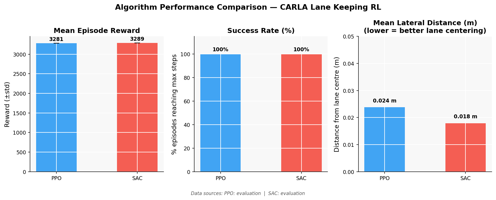
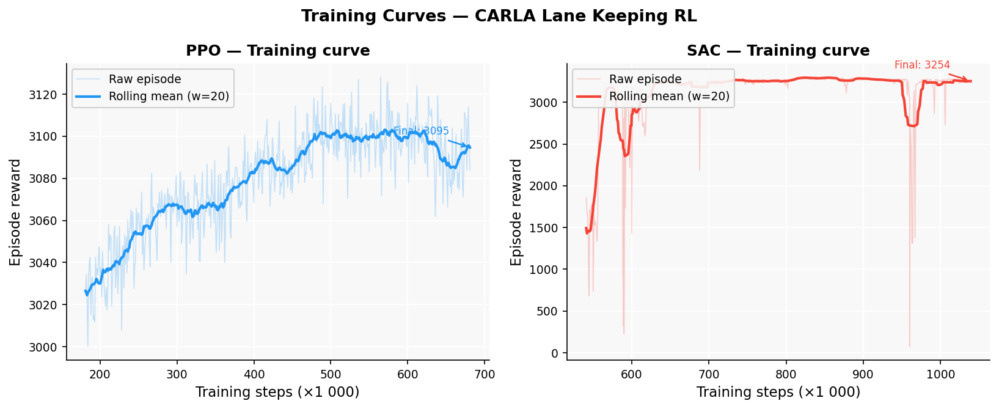
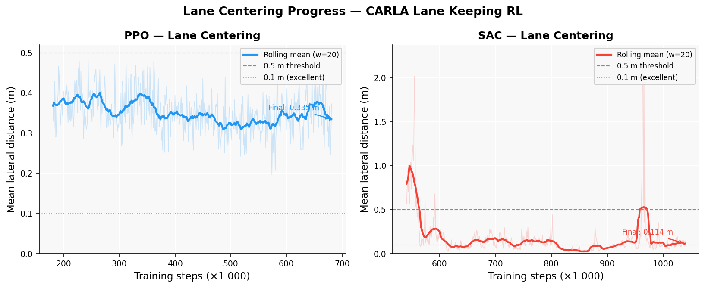
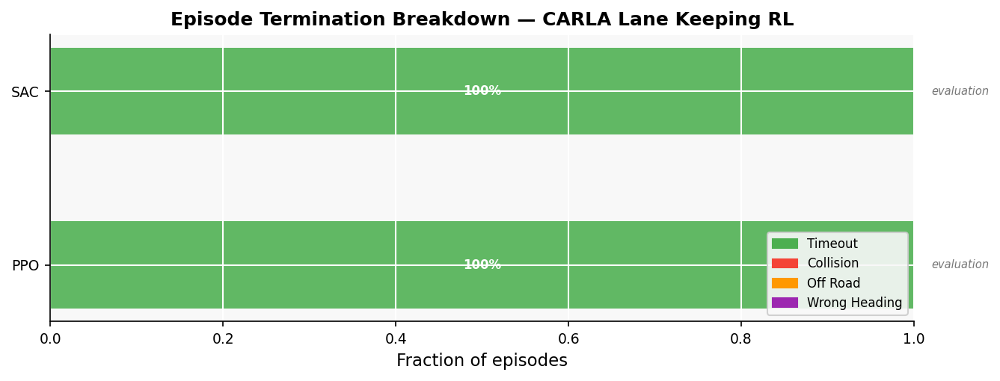

# Progress Report — CARLA RL Lane Keeping

**Author:** Konstantin  
**Date:** 2026-07-22  
**Simulator:** CARLA 0.9.15  
**Framework:** Stable-Baselines3 2.0.0 / Gymnasium 0.28.1 / Python 3.7.16

---

## 1. Goal

Research and compare multiple reinforcement learning algorithms for autonomous vehicle **lane keeping** in the CARLA driving simulator. The four algorithms under comparison are: **PPO**, **SAC**, **DDPG**, and **TD3**.

---

## 2. System Architecture

The agent observes a **4-dimensional state vector** and outputs **2-dimensional continuous control**:

| Component | Details |
|-----------|---------|
| **Observation** | `[lateral_distance, heading_error, speed, steering]` — all normalised to [-1, +1] |
| **Action** | `[acceleration, steer]` — continuous, mapped to CARLA throttle/brake/steer |
| **Episode** | Max 1000 steps = 50 simulated seconds at 20 Hz |
| **Map** | Town04 — highway loop, no intersections, fixed spawn point |
| **Simulation** | Synchronous mode, `fixed_delta_seconds = 0.05 s` |

### Reward Function

```
r = w_center  × (1 - |lat| / 3.5)
  + w_speed   × exp(-((speed - target)² / (2σ²)))
  + w_heading × (1 - |heading_error| / π)
  + w_smooth  × max(0, 1 - |Δaction| / 4)
  + step_penalty
  + terminal_penalty   (collision / off-road only)
```

| Weight | Value | Notes |
|--------|-------|-------|
| `w_center` | 1.0 | Lane-centering reward |
| `w_speed` | 1.5 | Gaussian speed reward, target 30 km/h, σ = 10 |
| `w_heading` | 0.5 | Heading alignment |
| `w_smooth` | 0.5 | Penalises abrupt action changes |
| `step_penalty` | -0.1 | Per-step cost, encourages efficient driving |
| `terminal_penalty` | -10.0 | Applied on collision or off-road exit |

### Termination Conditions

| Condition | Type | Meaning |
|-----------|------|---------|
| `|lateral_distance| ≥ 3.5 m` | `terminated` | Vehicle left the lane |
| Collision sensor fired | `terminated` | Vehicle crashed |
| `|heading_error| ≥ 90°` | `terminated` | Vehicle pointing wrong way |
| `step_count ≥ 1000` | `truncated` | Successful episode timeout |

---

## 3. Algorithm Configuration

All algorithms share the same environment and reward function. Key differences:

| | PPO | SAC | DDPG | TD3 |
|-|-----|-----|------|-----|
| **Type** | On-policy | Off-policy | Off-policy | Off-policy |
| **Policy** | Stochastic | Stochastic | Deterministic | Deterministic |
| **Exploration** | Entropy (ent_coef=0.05) | Auto entropy tuning | Gaussian noise (σ=0.1) | Gaussian noise (σ=0.1) |
| **Buffer** | Rollout (n_steps=2048) | Replay (200k) | Replay (200k) | Replay (200k) |
| **Batch size** | 64 | 256 | 256 | 256 |
| **Learning rate** | 3×10⁻⁴ | 3×10⁻⁴ | 1×10⁻³ | 1×10⁻³ |

> **PPO note:** Initial training with `ent_coef=0.01` led to a "stand-still" local optimum — the agent learned to stay stationary (reward ~1880/ep from centering + smoothness) rather than drive forward. Raising `ent_coef` to 0.05 resolved this by increasing exploration. SAC avoids this naturally via automatic entropy tuning.

---

## 4. Evaluation Protocol

All metrics come from **deterministic evaluation** (`model.predict(obs, deterministic=True)`):
- 20 episodes per algorithm
- Fixed spawn point (index 150, Town04 straight segment)
- Same reward function as training
- No action noise

Script: `python agent/evaluate.py --algo <algo> --checkpoint <path> --episodes 20`

---

## 5. Results

### 5.1 Summary Table

| Algorithm | Training Steps | Mean Reward | Std | Lateral Dist. | Success Rate | Episodes |
|-----------|---------------|-------------|-----|---------------|-------------|---------|
| **PPO** | 681k | **3280.89** | ±0.09 | 0.0238 m | **100%** | 20 |
| **SAC** | 1039k | **3289.21** | ±0.89 | **0.0179 m** | **100%** | 20 |
| DDPG | — | — | — | — | — | not trained |
| TD3 | — | — | — | — | — | not trained |

All episodes ran the full 1000 steps (50 simulated seconds) at approximately 30 km/h.

### 5.2 Performance Comparison



Both trained algorithms achieve **100% success rate** in deterministic evaluation. SAC shows slightly better lane centering (0.018 m vs 0.024 m mean lateral distance from centre), likely because it received ~50% more training steps (1039k vs 681k).

### 5.3 Training Curves



- **PPO** (left): Training curve shows the resumed run (181k → 681k steps). Reward steadily improves from ~3025 to ~3100, indicating the model had not yet fully converged.
- **SAC** (right): Final training phase (541k → 1039k steps, resumed from checkpoint). Reward is stable around 3250-3300 with occasional dips, consistent with a converged policy.

### 5.4 Lane Centering Progress



Mean lateral distance during training. Both algorithms achieve sub-0.5m centering (the dashed line) well before the end of training. The 0.1m dotted line ("excellent") is reached more reliably by SAC in the later training phase.

### 5.5 Termination Breakdown



In deterministic evaluation, both algorithms produce 100% timeout episodes — no crashes, no off-road exits, no wrong-heading terminations. The stochastic training policy has occasional failures (visible in the training curves' raw episode data).

---

## 6. Key Findings

1. **Both on-policy (PPO) and off-policy (SAC) RL can solve lane keeping** in CARLA with a low-dimensional observation (4D state vector), reaching 100% success rate and sub-3cm lane centering.

2. **SAC converges more reliably** due to automatic entropy tuning, which prevents the stand-still local optimum that PPO is susceptible to with a fixed entropy coefficient.

3. **PPO requires careful entropy tuning** — `ent_coef=0.05` was necessary after observing collapse to a stationary policy at `ent_coef=0.01`. This is a documented challenge for on-policy methods in continuous-control locomotion tasks.

4. **Action smoothing (α=0.6) is critical** — without it, the Gaussian sampling in PPO's stochastic policy produces large step-to-step steering changes that destabilise the vehicle.

5. **The low-dimensional observation is sufficient** — a 4D state vector (no camera, no lidar) is enough to solve deterministic lane keeping on a straight highway segment.

---

## 7. Remaining Work

| Task | Status |
|------|--------|
| PPO training (681k steps) | ✅ Complete |
| SAC training (1039k steps) | ✅ Complete |
| DDPG training (500k steps) | ⬜ Not started |
| TD3 training (500k steps) | ⬜ Not started |
| Full 4-algorithm comparison | ⬜ Pending DDPG/TD3 |
| Thesis documentation | ⬜ In progress |

---

## 8. Reproducibility

```bash
# Generate metrics table
python scripts/generate_metrics.py

# Generate all figures
python scripts/plot_metrics.py

# Evaluate a checkpoint (CARLA must be running)
python agent/evaluate.py --algo ppo \
    --checkpoint results/checkpoints/ppo/ppo_lane_keeping_20260722_112657/best_model/best_model.zip \
    --episodes 20

# Resume or start training
python agent/train.py --algo ddpg
python agent/train.py --algo td3
```

Figures update automatically when new evaluation CSVs are added — no manual editing required.
